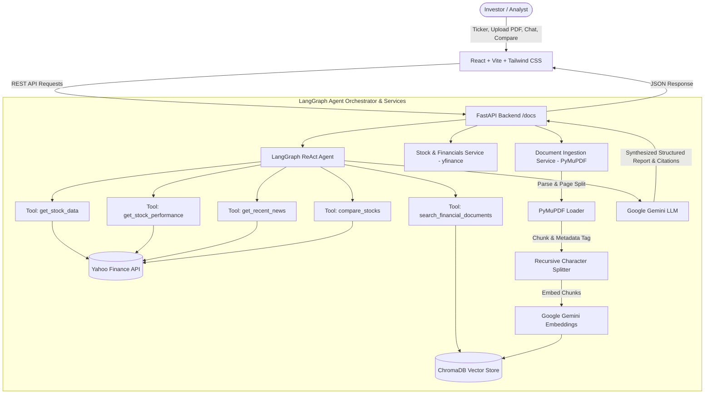

# InvestIQ — Agentic Investment Research & Decision Support Platform


**InvestIQ** is an institutional-grade, AI-powered investment research and decision-support platform. It synthesizes real-time market data, historical price volatility, fundamental financial statements, recent news developments, and semantic **Retrieval-Augmented Generation (RAG)** over uploaded corporate filings (10-K, 10-Q, earnings call transcripts) orchestrated by a **LangGraph** agent.

> **Important Compliance Disclaimer**:
> InvestIQ is an analytical decision-support and educational research tool, **not** an automated trading bot, algorithmic execution engine, or provider of individualized financial advice. All investments carry risk, and users must perform their own independent due diligence.

---

## 🏛️ System Architecture



---

## 💡 Why RAG and Agent Orchestration are Essential for Finance

1. **Market Data Changes Every Second, While Filings Anchor Long-Term Truth**:
   - Market pricing, multiples, and news sentiment change continuously.
   - However, audited financial statements (10-K/10-Q), segment disclosures, and legal risks are buried inside dense 100+ page corporate reports.
   - **RAG** allows the system to ground its analysis in verified regulatory disclosures rather than hallucinating corporate metrics.
2. **Autonomous Tool Decisioning via LangGraph**:
   - Unlike static prompts that send a generic query to an LLM, the **LangGraph Agent** autonomously determines which data sources are relevant.
   - If the user asks about valuation, the agent calls `get_stock_data`.
   - If the user asks about supply chain or export regulations, the agent routes to `search_financial_documents`.
   - If comparing two competitors (e.g. `NVDA vs AMD`), the agent invokes `compare_stocks`.
3. **Auditable, Verifiable Citations**:
   - Every piece of information retrieved from corporate filings is linked to an exact source and page number: `[Source: NVIDIA_10K.pdf, Page 47]`.


---

## 🚀 Key Features

- 📊 **Real-Time Market Snapshot**: Live price, day change ($ and %), market cap, trailing P/E, forward P/E, EPS, volume, and an interactive 52-week trading range bar.
- 📈 **Price Performance & Volatility**: Interactive area chart with 1M, 3M, 6M, and 1Y range toggles, multi-horizon returns, and annualized historical volatility.
- 🏛️ **Fundamental Financial Profile**: TTM revenue, net income, gross margin, operating margin, profit margin, free cash flow, debt-to-equity, P/S, and P/B ratios.
- 🟢🟡🔴 **AI Investment Thesis (Scenario Analysis)**:
  - **Bull Case**: Key growth catalysts, competitive moats, pricing power, and market expansion.
  - **Base Case**: Realistic consensus outlook tracking fundamental execution and normalized margins.
  - **Bear Case**: Downside vulnerabilities, macroeconomic headwinds, and valuation multiple compression.
- 🛡️ **Risk Factors Breakdown**: Categorized into Operational, Market/Macro, Regulatory/Geopolitical, and Valuation risks.
- 📰 **News Sentiment Monitoring**: Recent headlines with publishers, timestamps, external links, and qualitative sentiment reasoning with visual score indicator.
- 📑 **RAG Document Ingestion**: Upload corporate PDFs (10-Ks, 10-Qs, transcripts); automatic page-level chunking, metadata tagging, and vector storage in ChromaDB.
- 💬 **Ask InvestIQ (Follow-up Chat)**: Context-aware interactive Q&A powered by the LangGraph agent, showing tools invoked and grounded citations.
- ⚖️ **Head-to-Head Stock Comparison**: Side-by-side metric comparison table and comparative AI synthesis (e.g. NVDA vs AMD).

---

## 🛠️ Tech Stack

| Layer | Technologies |
|---|---|
| **Backend Framework** | Python 3.11+, FastAPI, Uvicorn, Pydantic v2 |
| **Agent Orchestration** | LangGraph, LangChain Core |
| **LLM & Embeddings** | Google Gemini (`gemini-2.5-flash`, `models/text-embedding-004`) |
| **Vector Database** | ChromaDB (`chromadb`, `langchain-chroma`) |
| **PDF Ingestion** | PyMuPDF (`fitz`), RecursiveCharacterTextSplitter |
| **Market Data** | yfinance, Pandas, NumPy |
| **Frontend UI** | React 19, Vite, Tailwind CSS v4, Lucide React, Recharts |

---

## 🧰 Agent Tools

The LangGraph agent has access to 5 specialized tools:
1. `get_stock_data(ticker: str)`: Returns current price, market cap, P/E, forward P/E, EPS, 52-week high/low, sector, and industry.
2. `get_stock_performance(ticker: str)`: Computes 1M, 3M, 6M, and 1Y percentage returns, plus annualized historical volatility.
3. `get_recent_news(ticker: str)`: Retrieves recent news articles, publishers, summaries, and publication timestamps.
4. `search_financial_documents(query: str, ticker: str = "")`: Performs semantic vector retrieval across uploaded corporate documents in ChromaDB with exact citations `[Source: filename, Page X]`.
5. `compare_stocks(ticker_a: str, ticker_b: str)`: Fetches side-by-side comparative fundamental metrics for two companies.

---

## 🔌 API Endpoints Reference

Interactive Swagger documentation is available at `http://localhost:8000/docs`.

| Method | Endpoint | Description |
|---|---|---|
| `GET` | `/api/health` | Health status and LLM/vector store availability |
| `GET` | `/api/stock/{ticker}` | Returns live market snapshot for ticker |
| `GET` | `/api/stock/{ticker}/performance` | Returns multi-horizon returns and historical price points |
| `GET` | `/api/stock/{ticker}/fundamentals` | Returns financial fundamentals and ratios |
| `GET` | `/api/stock/{ticker}/news` | Returns recent news items |
| `POST` | `/api/documents/upload` | Ingests a corporate PDF and indexes chunks into ChromaDB |
| `GET` | `/api/documents` | Lists all indexed documents and vector chunk counts |
| `POST` | `/api/analyze?ticker={ticker}` | Generates full structured research report |
| `POST` | `/api/chat` | Follow-up conversational agent query with citation grounding |
| `POST` | `/api/compare` | Head-to-head stock comparison and synthesis |

---

## ⚙️ Setup & Installation

### Prerequisites
- Python 3.11, 3.12, or 3.13
- Node.js v18+ and npm
- (Optional) Google Gemini API Key (`GOOGLE_API_KEY`)

### 1. Clone & Configure Environment
```bash
git clone <repo-url>
cd InvestIQ

# Copy environment template
cp .env.example .env
```

Edit `.env` and provide your Google Gemini API key:
```env
GOOGLE_API_KEY=your_gemini_api_key_here
GEMINI_MODEL=gemini-2.5-flash
```
*(Note: If `GOOGLE_API_KEY` is omitted, InvestIQ runs in fallback mode with real market data, charting, news, and rule-based synthesis without crashing).*

### 2. Backend Setup
```bash
# Create virtual environment
python -m venv .venv

# Activate virtual environment
# Windows (PowerShell):
.venv\Scripts\Activate.ps1
# Linux / macOS:
source .venv/bin/activate

# Install dependencies
pip install -r requirements.txt

# Start FastAPI server
uvicorn backend.main:app --host 0.0.0.0 --port 8000 --reload
```
The backend will be running at `http://localhost:8000` (Docs: `http://localhost:8000/docs`).

### 3. Frontend Setup
In a new terminal:
```bash
cd frontend

# Install packages
npm install

# Start Vite development server
npm run dev
```
Open `http://localhost:5173` in your browser.

---

## 🔍 Example Queries & Usage

1. **Analyze a Major Ticker**:
   - Enter `NVDA`, `AAPL`, or `MSFT` in the search bar and click **Analyze**.
   - Review the **Overall Research Signal**, **Bull/Base/Bear Thesis**, **Price Chart**, and **Risk Factors**.
2. **Ingest Financial Documents**:
   - Scroll to the **Financial Document Ingestion** section.
   - Upload an annual report (e.g. `NVIDIA_10K_Sample.pdf` located in `data/documents/`).
   - The PDF is parsed and vectorized into ChromaDB.
3. **Ask Follow-up Questions Grounded in Filings**:
   - In the **Ask InvestIQ** chat box, ask:
     - *"What does the 10-K say about China exposure and TSMC?"*
     - *"Why are gross margins expanding in the Data Center segment?"*
     - *"What are management's primary risks regarding export controls?"*
   - Observe the agent invoking `search_financial_documents` and returning grounded answers with page citations: `[Source: NVIDIA_10K_Sample.pdf, Page 2]`.
4. **Compare Two Stocks**:
   - Toggle to **Compare Stocks** mode in the header.
   - Compare `NVDA` vs `AMD` or `AAPL` vs `MSFT`.
   - Inspect the comparative metrics matrix and AI comparative trade-off analysis.

---

## 🔮 Future Roadmap

- [ ] **Multi-Document Cross-Quarter Diffing**: Automatic delta analysis between sequential 10-Q filings.
- [ ] **SEC EDGAR Direct Ingestion**: One-click download and indexing of official SEC filings by CIK/Ticker.
- [ ] **Portfolio Tracking & Watchlist Alerts**: Multi-asset tracking with agentic anomaly alerts.
- [ ] **Macroeconomic Indicator Tools**: Integration of FRED (Federal Reserve Economic Data) for interest rate and inflation context.
- [ ] **Multi-Agent Debate Protocol**: Specialized Bull Agent and Bear Agent engaging in adversarial debate before final research synthesis.
